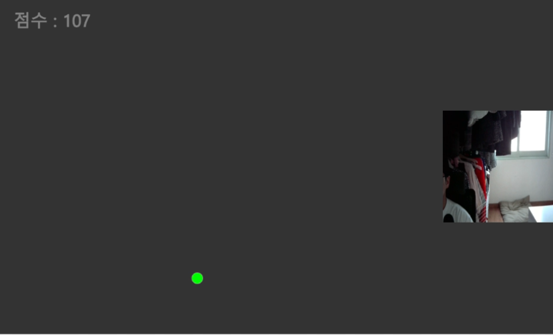
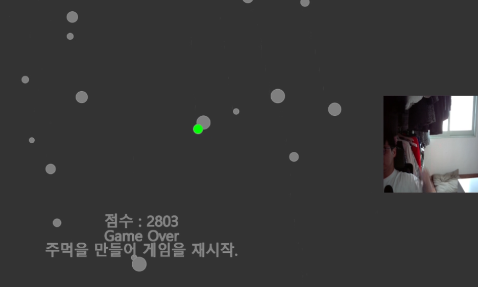
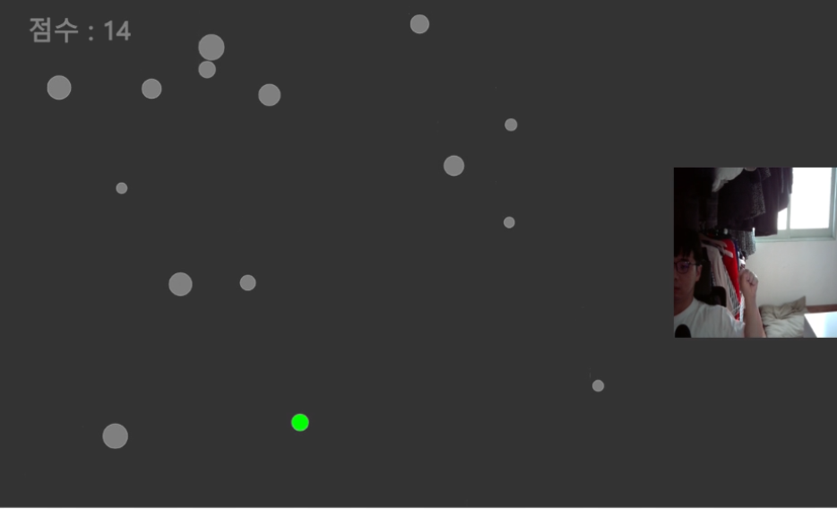

# ml5.js 딥러닝 라이브러리를 이용해 손의 움직임으로 게임을 조작하는것에 대한 연구
 
<table>
  <h2>5팀</h2>
  <tr>
    <td>
      구분
    </td>
    <td>
      이름
    </td>
    <td>
      학과
    </td>
    <td>
      학년
    </td>
    <td>
      휴대폰
    </td>
    <td>
      담당업무
    </td>
  </tr>
  <tr>
    <td>
      팀장
    </td>
    <td>
      서인교
    </td>
    <td>
      컴퓨터공학과
    </td>
    <td>
      4
    </td>
    <td>
      010-9014-7630
    </td>
    <td>
      레퍼런스 조사 및 테스트
    </td>
  </tr>
  <tr>
    <td>
      팀원
    </td>
    <td>
      박성국
    </td>
    <td>
      컴퓨터공학과
    </td>
    <td>
      4
    </td>
    <td>
      010-2798-6852
    </td>
    <td>
      자바스크립트 코딩 및 유지보수
    </td>
  </tr>
</table>

 
<h2>과제 요약</h2> 
<h3>ml5.js를 이용해 사용자의 손을 인식하고, 인식한 손을 토대로 게임을 조작하는 것을 
  구현하여 실제 게임과 인공지능을 엮는 방법에 대해서 연구하도록 함.</h3>

 
<h2>과제 구현</h2>

  <h3>과제 링크</h3>
  <h4>
    [https://editor.p5js.org/deps62/sketches/4JgGkFgqS](https://editor.p5js.org/Ingyo-Seo/sketches/_DZ9T2eC](https://editor.p5js.org/Ingyo-Seo/sketches/_DZ9T2eC_)
    https://editor.p5js.org/Ingyo-Seo/full/_DZ9T2eC_
  </h4>

  <h3>과제 내용</h3>
  <h4>
    (1) 프로그램이 시작되면 화면 상단에서 하단으로 장애물이 떨어지기 시작한다. 
    (2) 화면 오른쪽에 카메라가 표시되면서 사용자가 손가락으로 방향을 지시하여 이동을 할 수 있다. 
    (3) 장애물을 피하면 매 프레임마다 왼쪽 상단에 점수가 올라간다. 
    (4) 장애물과 충돌하면 Game Over를 출력하면서 최종 점수와 재시작 가이드 텍스트를 표시해준다. 
    (5) 주먹을 쥐면 게임을 재시작하도록 구현하였다.
  </h4>

  <h3>과제 실행</h3>
  <h4>
    
    
    
    
    
  </h4>

  <h3>과제 동영상 링크</h3>
  <h4>
    https://youtu.be/BscnrKMb7zg
  </h4>

  <h3>
    기대효과 및 활용방안
  </h3>
  <h4>
     과제에서는 손짓만을 이용하여 진행한다. 만약 연구가 순조롭게 진행된다면 
     조금 더 나가가서 전체 몸짓을 이용한 게임 등에도 적용할 수 있지 않을까 생각한다.
  </h4>

<h2>참고 문헌</h2>
https://wikidocs.net/103185 - ml5.js 사용법 
https://codepen.io/fleemaja/pen/jOPmXyZ Kayak Game - open source 
http://news.bizwatch.co.kr/article/industry/2022/04/22/0033 Hand Tracking - News 
https://www.koreascience.or.kr/article/JAKO201919866854640.pdf Real-Time Hand Gesture Recognition Based on Deep Learnin - Paper<
